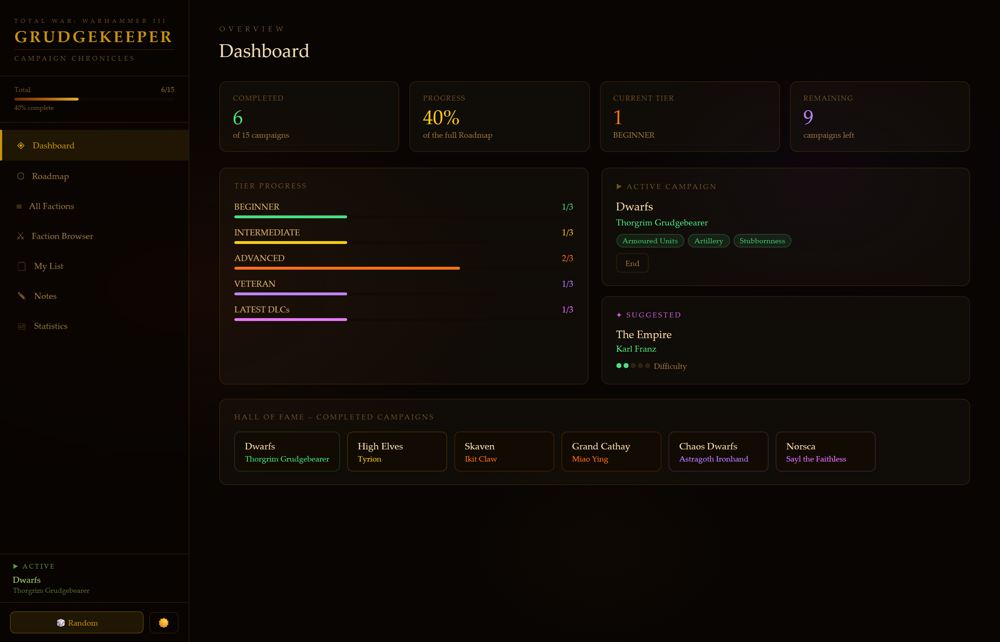
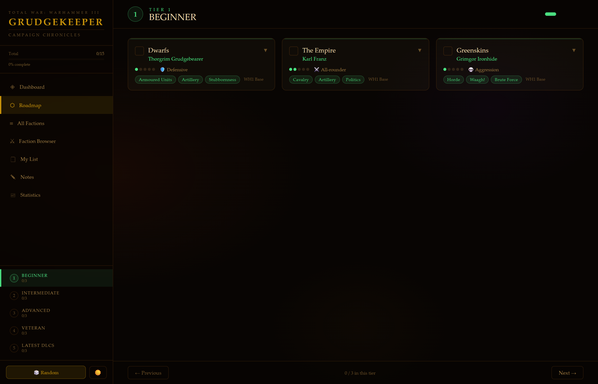
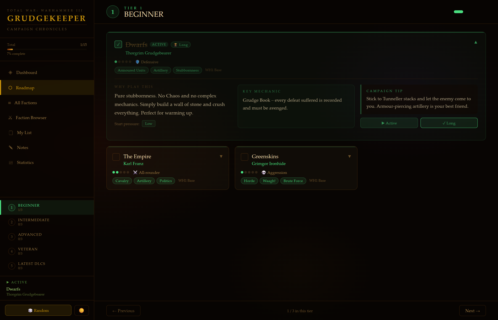
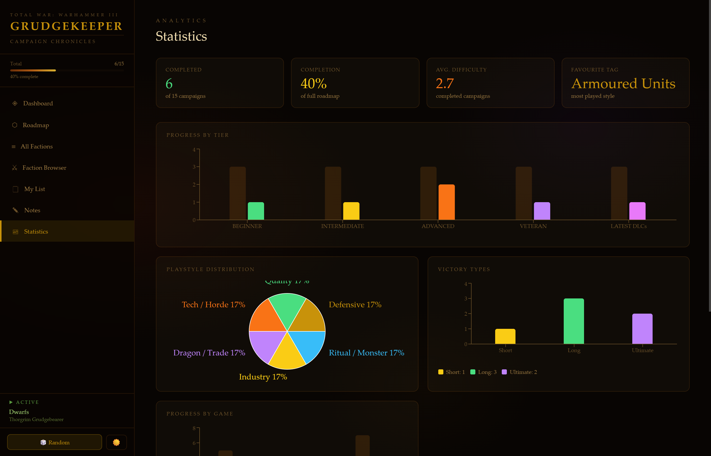

# Grudgekeeper — Campaign Chronicles

> A campaign progression tracker for **Total War: Warhammer III**

Track every campaign you've played, log your victory type, analyse your stats and plan what to play next — all stored locally on your device, no account needed.


---

## Download

**[⬇ Download latest release](https://github.com/ZintelFelix/grudgekeeper/releases/latest)**

Windows only. No installation of Node.js or any other software required — just download, install and play.

---

## Screenshots


_Dashboard — active campaign, tier progress, hall of fame and next suggestion_


_Roadmap — tiered campaign guide with difficulty dots, playstyle tags and DLC info_


_Expanded card — why to play, key mechanic, campaign tip and victory tracking_


_Statistics — completion charts, playstyle distribution and victory type breakdown_

---

## Features

- **Roadmap** — tiered campaign guide covering all 24 races with difficulty ratings, playstyle tags, start pressure, campaign tips and key mechanics
- **All Factions** — filterable and sortable table of all roadmap entries with completion status
- **Faction Browser** — browse all Legendary Lords organised by race, build a custom play queue
- **My List** — personal campaign queue with reordering, victory tracking and per-campaign notes
- **Statistics** — charts for tier progress, playstyle distribution, victory types, game origin (WH1/WH2/WH3) and Base vs. DLC breakdown
- **Notes** — freeform notebook for strategies, observations and campaign impressions
- **Random Picker** — spin the dice and let Grudgekeeper pick your next campaign
- **Dark & Light Mode** — TWW3-authentic dark theme and a Dwarf-inspired stone/gold light theme
- **Fully local** — all progress saved on your device, no server, no login, no tracking

---

## Tech Stack

| Tool                                   | Purpose                      |
| -------------------------------------- | ---------------------------- |
| [React 18](https://react.dev)          | UI framework                 |
| [Vite 5](https://vitejs.dev)           | Build tool                   |
| [Electron](https://www.electronjs.org) | Desktop app wrapper          |
| [Recharts](https://recharts.org)       | Charts in Statistics         |
| [PapaParse](https://www.papaparse.com) | CSV parsing for faction data |

---

## Getting Started

### For end users

Download the installer from the [Releases page](https://github.com/ZintelFelix/grudgekeeper/releases/latest), run it and follow the setup wizard. No additional software required.

### For developers

Prerequisites: Node.js 18+, npm

```bash
git clone https://github.com/ZintelFelix/grudgekeeper.git
cd grudgekeeper
npm install
npm run electron:dev
```

Run in the browser instead:

```bash
npm run dev
```

Build a Windows installer:

```bash
npm run electron:build
```

---

## Project Structure

```
grudgekeeper/
├── public/
│   └── data/
│       ├── roadmap.csv     # Campaign data (tier, faction, lord, tips...)
│       └── races.csv       # All Legendary Lords with faction icons
├── src/
│   ├── components/         # DiffDots, Tag, PressureBadge, RandomPicker
│   ├── context/            # ThemeContext (DARK / LIGHT)
│   ├── hooks/              # usePersist, useCSV
│   └── views/              # Dashboard, Roadmap, AllFactions, FactionBrowser,
│                           # MyList, Notes, Statistics
├── screenshots/            # Screenshots for this README
└── README.md
```

---

## Data

All campaign data lives in two CSV files under `public/data/`. No backend required.

- **`roadmap.csv`** — one row per faction with fields for tier, faction, lord, difficulty, length, playstyle, tags, why-to-play, campaign tip and key mechanic
- **`races.csv`** — one row per Legendary Lord with race, icon URL, game origin and DLC info

Want to add a faction or fix a difficulty rating? Just edit the CSV — no code changes needed.

---

## Roadmap

- [ ] Per-lord entries — currently one entry per faction, per-lord breakdowns planned
- [ ] DLC Tracker — mark which DLCs you own; lock icons on missing content
- [ ] Campaign Journal — per-campaign log with date, rating and notes
- [ ] Achievement System — self-defined challenges
- [ ] Faction Comparison — side-by-side view of two factions

---

## Contributing

Contributions are welcome. If you want to add factions, fix data or improve the UI:

1. Fork the repo
2. Create a branch (`git checkout -b feature/your-feature`)
3. Commit your changes
4. Open a Pull Request

For data corrections (wrong difficulty rating, missing lord, outdated DLC info) a PR editing the CSV files is perfect and needs no React knowledge.

---

## Disclaimer

This is a fan project. Total War: Warhammer III and all related content are the property of Creative Assembly and SEGA. Faction icons are sourced from the [Total War Wiki](https://totalwar.wiki.gg) under fair use for non-commercial purposes.

---

## License

[MIT](LICENSE) — free to use, modify and distribute.
